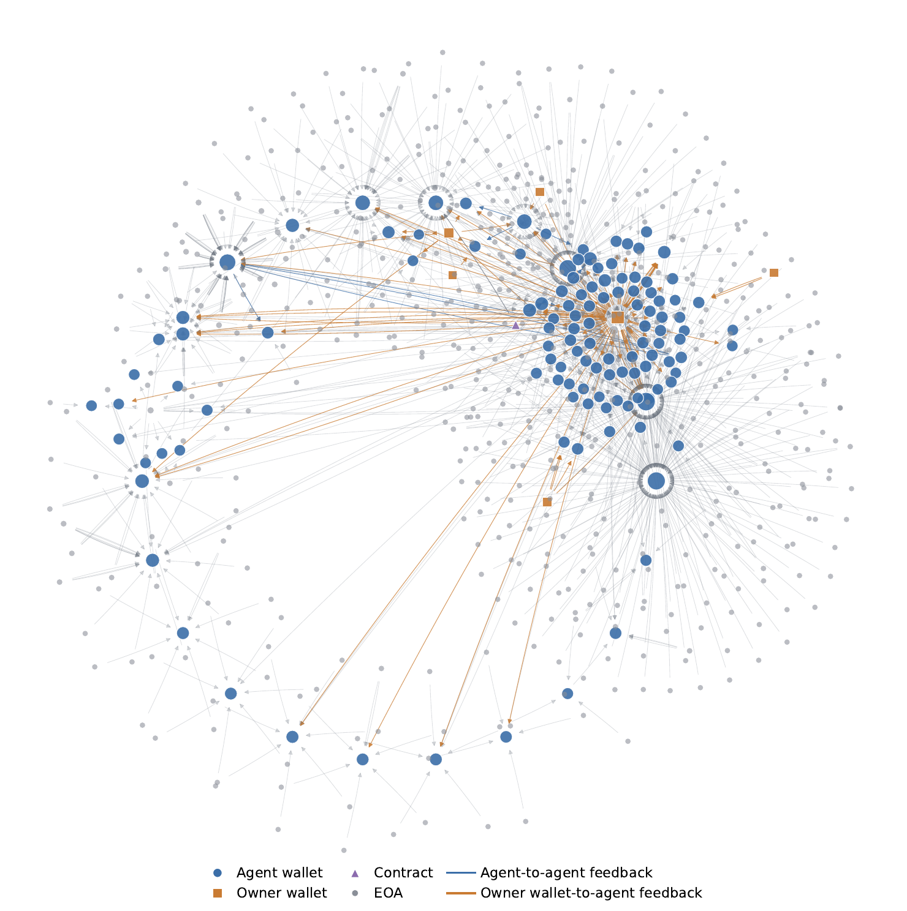

# ERC8004 Data Pipeline

Collect ERC-8004 agent data from Ethereum and analyze the data from three perspectives: activity-reputation relationship, feedback network, zombie & batch agents distribution and correlation.



## Setup

```bash
pip install -r requirements.txt
cp scripts/.env.example scripts/.env
```

Fill `scripts/.env` with local runtime settings. Do not commit `.env`.

Minimal Etherscan setup:

```env
ETHEREUM_ARCHIVE_RPC=https://your-archive-rpc.example
ETHERSCAN_API_KEY=your_etherscan_key
USE_ETHERSCAN=true
```

Optional settings:

- `RERUN_ALL_AGENT`: set `true` to rebuild the full agent list.
- `RERUN_REPUTATION`: set `true` to refetch reputation data.
- `RERUN_TRANSACTION`: set `true` to refetch transaction data.
- `TARGET_AGENT_ID_MIN` / `TARGET_AGENT_ID_MAX`: agent ID range to include.
- `TARGET_AGENT_COUNT`: maximum number of discovered candidate agents.
- `TOP_AGENT_COUNT`: number of selected agents used for reputation and transaction collection.

## Data Collection

Recommended:

```bash
python scripts/main_etherscan.py
```

Pure RPC-node version:

```bash
python scripts/main_node.py
```

`main_node.py` scans full blocks and can be slow if your node does not keep an address-to-transaction index. Use `main_etherscan.py` for faster transaction collection.

## Analysis

```bash
python analysis/causal_activity_reputation.py
python analysis/feedback_network.py
python analysis/zombie&batch.py
```

## Git Ignore Policy

Generated folders are ignored:

- `data/`
- `causal/`
- `network/`
- `zombie&batch/`

Local secrets are ignored:

- `.env`
- `scripts/.env`


## Acknowledgement

This project was developed with reference to [YulinLiu20/ERC8004](https://github.com/YulinLiu20/ERC8004). The current repository substantially modifies the original pipeline for local CSV-based data collection, Etherscan/node transaction collection variants, reputation cleaning, and downstream analysis.

## Data Link

If you do not want to crawl the chain yourself, you can download the collected `data/` CSV files from Zenodo:

https://zenodo.org/records/20676023

This record contains the collection data only, from blocks 24,339,925 to 25,277,687 (Jan 29, 2026 to Jun 09, 2026). Analysis outputs should be regenerated locally with the scripts above.
